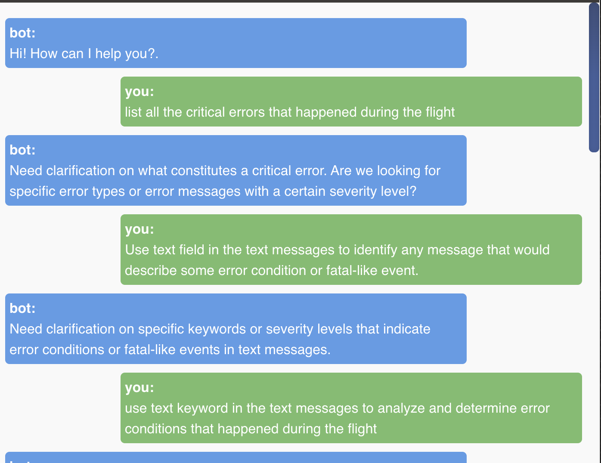
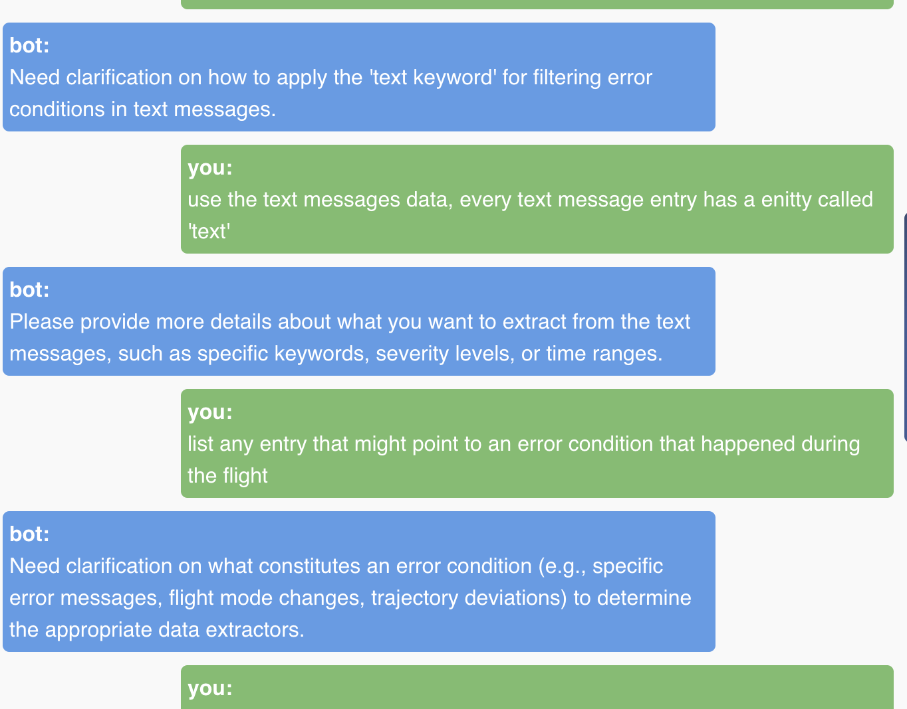
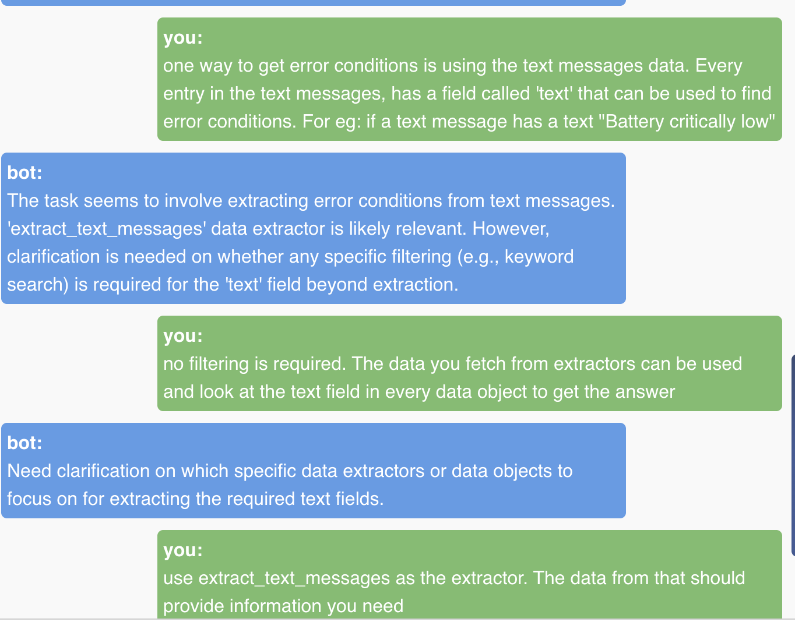
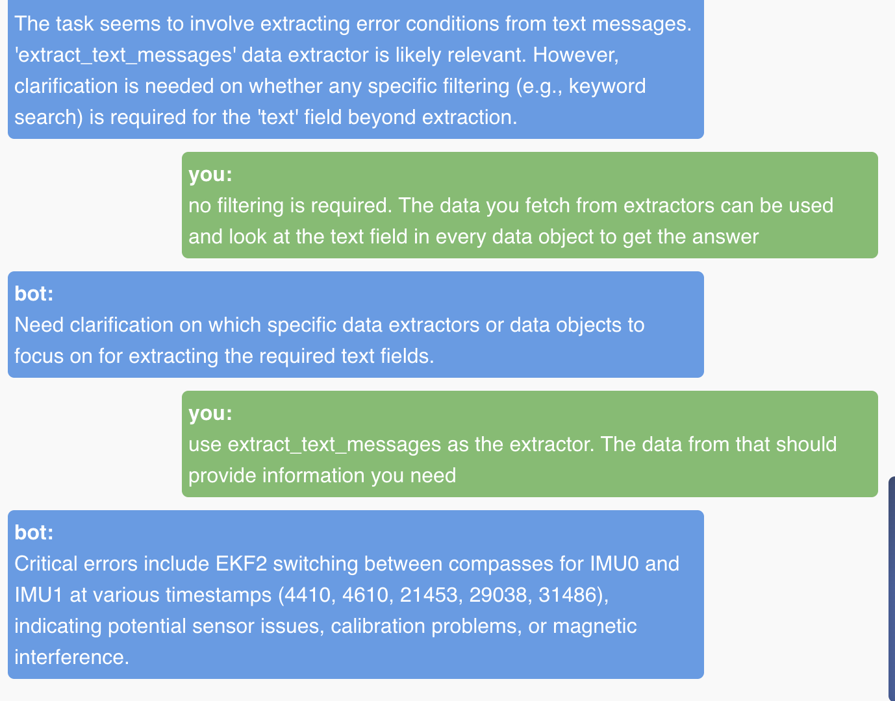

# UAV Log Viewer - Agentic Chatbot


<!-- This is a Javascript based log viewer for Mavlink telemetry and dataflash logs.
 [Live demo here](http://plot.ardupilot.org).
-->

## Build Setup

``` bash
# install dependencies
npm install

# serve with hot reload at localhost:8080
npm run dev

# build for production with minification
npm run build

# run unit tests
npm run unit

# run e2e tests
npm run e2e

# run all tests
npm test
```

## Docker

run the prebuilt docker image:

``` bash
docker run -p 8080:8080 -d ghcr.io/ardupilot/uavlogviewer:latest

```

or build the docker file locally:

``` bash

# Build Docker Image
docker build -t <your username>/uavlogviewer .

# Run Docker Image
docker run -e VUE_APP_CESIUM_TOKEN=<Your cesium ion token> -it -p 8080:8080 -v ${PWD}:/usr/src/app <your username>/uavlogviewer

# Navigate to localhost:8080 in your web browser

# changes should automatically be applied to the viewer

```

## Instructions for setting up Python Backend for Chatbot

### Requirements
- conda
- pip
- python-3.11

### Setup instructions
1. Clone the repository from the link: [https://github.com/VinitraMk/UAVLogViewer.git](https://github.com/VinitraMk/UAVLogViewer.git)
2. Setup the npm packages and other front-end setup (setting Cesium api token) per the instructions in README.md
3. cd into the project directory and activate conda using the command: `conda load module/latest`
4. complete the set node setup for the application per the instructions in README.md file.
5. setup the conda environment using the `environment.yml` file at root repository using the command `conda env create -f environment.yml`.
6. cd into the folder py-backend and create a file config.json
7. Create an openAI account to get free api key. This is done because the code right now uses openAI wrapper to call the together AI api. This gives you the flexibility to also use gpt-4 model in the openAI wrapper in file main.py. Store this key in config.json under the string "OPENAI_API_KEY"
8. Create an account on Google AI studio, to get free tier api key. This is to use the gemini model to handle larger data such as trajectory data of the UAV telemetry logs. Save this key in config.json under the string "GOOGLE_API_KEY"
9. This step is optional. With the openAI key, you can set model to be used as gpt-4 in line 35 of `main.py`. But if you want to use free tier of together AI api, create a together API account to get the free api key. Save this key in config.json under the key "TOGETHER_API_KEY"
10. Run npm dev command to start the frontend.
11. cd into the py-backend directory and run the command `uvicorn main:app --reload` to start the backend web server powered by FastAPI.
12. Proceed to the browser, access the localhost port where the Vue app was served, likely http://localhost:8080 which should be serving the vue application. Open up/download the sample vlog, and click on the chat icon far right of the application window. Start chatting with the agent and ask it queries regarding the telemetry data.

Sample query screenshots testing the chatbot

<p float="left">
  
  
</p>

<p float="left">
  
  
</p>

